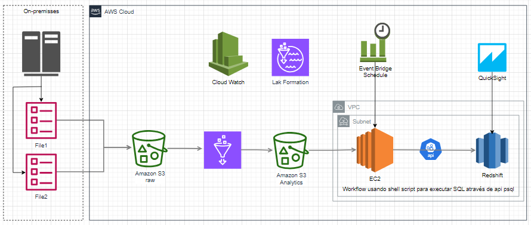

# Datalake Company Retail

## Introdução

Este repositório contém a documentação e scripts relacionados a uma arquitetura de ingestão, processamento e análise de dados utilizando serviços da AWS. A solução foi projetada para integrar dados provenientes de um ambiente on-premises com a AWS, garantindo um fluxo eficiente e seguro de dados desde a captura inicial até a visualização final.

Visão Geral da Arquitetura
On-Premises: Dados são inicialmente armazenados em servidores on-premises, com arquivos sendo transferidos para a AWS.

Amazon S3 (Raw e Analytics): Os arquivos são carregados no Amazon S3, onde são primeiramente armazenados como dados brutos (raw data). Em seguida, os dados são movidos para um bucket Analytics de S3 em formato parquet destinado a análises, onde são transformados para facilitar o processamento subsequente.

EC2 Instance: Uma instância EC2 executa scripts shell que utilizam psql para interagir com o Amazon Redshift, enviando comandos SQL para processamento dos dados.

Amazon Redshift: Os dados processados são armazenados e analisados no Amazon Redshift, um data warehouse totalmente gerenciado.

Amazon QuickSight: Ferramenta de visualização de dados utilizada para criar dashboards e relatórios interativos a partir dos dados armazenados no Redshift.

Serviços Adicionais:

AWS CloudWatch: Monitora a infraestrutura e o fluxo de dados.
AWS Lake Formation: Gerencia a segurança e o catálogo de dados.
AWS EventBridge: Coordena a execução automatizada dos scripts SQL no EC2, utilizando agendamentos para garantir a sincronia do fluxo de trabalho.
Esta solução foi desenvolvida para ser escalável e segura, permitindo que grandes volumes de dados sejam processados e analisados de maneira eficiente.

Esta arquitetura de uma solução baseada em AWS para ingestão, processamento e análise de dados provenientes de um ambiente on-premises. A solução integra diversos serviços gerenciados da AWS para garantir um fluxo eficiente e seguro de dados desde a origem até a visualização final.

## Tarefas

Passo 1: Após a criação do ambiente na AWS, execute o comando abaixo:

cd code
python lambda_function.py "{'database_name':'companyretail_datalake_dev_raw','sql_files_directory':'.\\tabelas','athena_query_output':'s3://aws-athena-resultquery/'}"

Passo 2: Execute o Job 